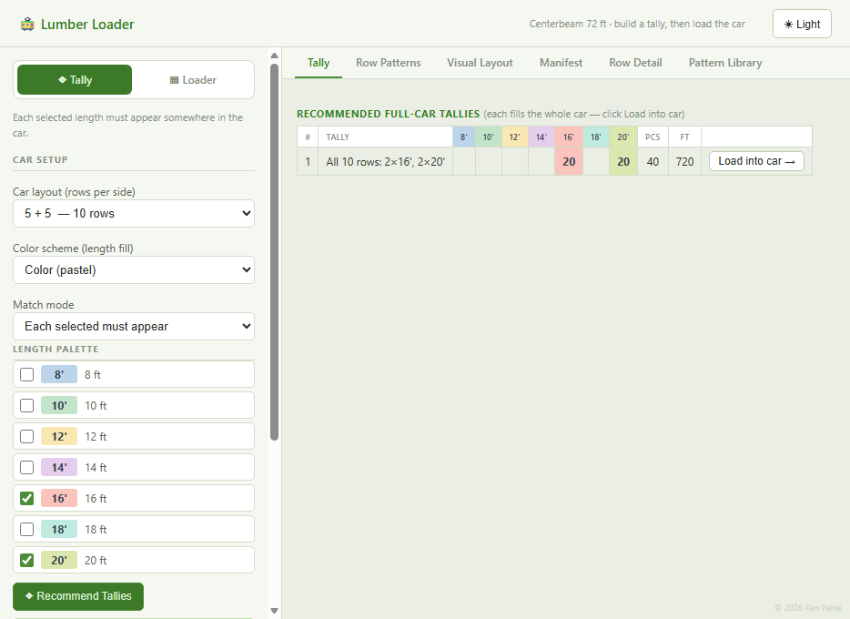

# Centerbeam Lumber Car Tools

[](https://github.com/kenpaine/Lumber-Load-Planning/releases/latest)

## ▶ [Open Lumber Loader](https://kenpaine.github.io/Lumber-Load-Planning/lumber_loader.html)

Or start at the **[App Hub](https://kenpaine.github.io/Lumber-Load-Planning/)** — a single page that opens the app in one tap and links to the Excel download.

[](https://kenpaine.github.io/Lumber-Load-Planning/)

**One tool, two modes** for loading **72‑ft centerbeam rail cars** with dimensional lumber, where every car row must fill end‑to‑end to **exactly 72 ft**:

| Mode | What it does |
|---|---|
| **Tally** | Pick the lengths you want and get complete, loadable full‑car tallies (720 ft / 864 ft / 1008 ft). Three match modes, click‑to‑sort tables, hand‑build grid. |
| **Loader** | Enter your pack inventory (product × length × grade) and solve the full car layout — visual diagram, row detail, printable manifest. |

Tap **Load into car →** in Tally mode to send a recommended tally straight into the Loader — the two modes form one connected workflow.

|  | Open in browser — no install | Download for Excel |
|---|---|---|
| 🚃 **Lumber Loader** | [▶ Launch](https://kenpaine.github.io/Lumber-Load-Planning/lumber_loader.html) | [⬇ `.xlsm`](https://github.com/kenpaine/Lumber-Load-Planning/releases/latest/download/Lumber_Loader.xlsm) |

> **After downloading the `.xlsm`:** right‑click → **Properties** → check **Unblock** → **OK**, then open it and click **Enable Content**. The browser app needs neither step.

---

## Lumber Loader — browser app

Full‑featured, mobile‑friendly app — open it in any browser, no install, no macros.

[](https://kenpaine.github.io/Lumber-Load-Planning/lumber_loader.html)

### Tally mode

1. **Set the Car layout** — 5+5 (10 rows, 720 ft), **7+5 (mixed, 12 rows, 864 ft)**, or 7+7 (14 rows, 1008 ft).
2. **Choose a Color scheme** — pastel, high contrast, B&W, and nine others. Recolors the palette, tables, visual layout, and manifest.
3. **Pick your lengths** — check the lengths you want in the car.
4. **Choose a Match mode:**
   - *Palette — use only selected:* tallies use only the checked lengths.
   - *Each selected must appear* (default): every checked length shows up somewhere.
   - *Each must appear + fillers:* every checked length appears; other lengths may finish a row.
5. Click **Recommend Tallies** — the **Tally** tab lists every valid full‑car tally, with piece counts per length, totals, and an **OK** mark. Click any column header to sort.
6. On the **Row Patterns** tab, type **Rows to use** for each 72‑ft pattern to **hand‑build a custom car** — the running total shows *rows / target* with an **OK** when it matches.
7. Click **Load into car →** to send any tally straight into Loader mode and solve.

On a **mixed 7+5** car, Tally mode shows a separate length palette and tally table for each side (7‑row = 504 ft, 5‑row = 360 ft).

### Loader mode

[](https://kenpaine.github.io/Lumber-Load-Planning/lumber_loader.html)

1. **Add your inventory** — pick Product, Length, Grade, and pack count, then **+ Add to Inventory**. Total Lineal Footage and capacity update live.
2. On a **mixed 7+5** car, each inventory line gets a **Side** toggle (7‑row / 5‑row); the two sides solve independently.
3. Click **⚡ Solve Layout** — the solver fills each row to exactly 72 ft and stacks like packs into columns.
4. Read the result on the tabs:
   - **Visual Layout** — to‑scale, zoomable car diagram; hover any pack to inspect it.
   - **Row Detail** — per‑row breakdown with pack labels.
   - **Manifest** — the printable one‑page car diagram + pick list (see below).
   - **Pattern Library** — every 72‑ft length combination, click‑to‑sort.

### Manifest tab

[](https://kenpaine.github.io/Lumber-Load-Planning/lumber_loader.html)

The **Manifest** is built for a clean **one‑page landscape** print:

- **Car Layout — drawn to scale**, split per side: each pack is a rectangle whose width equals its length, laid out against a 0–72 ft ruler.
- **Pick List** — only the loaded line items (product × length × grade × packs). A long list wraps into columns so the diagram stays as large as possible.
- **Color palette** selector — choose **Color** (pastel), **High contrast** (saturated), or **B & W (print)** (grayscale) for clean black‑and‑white printing.

---

## Lumber Loader — Excel workbook

Macro‑enabled workbook (`Lumber_Loader.xlsm`) with the same two‑mode workflow.

**Tally side** (Tally + Row Patterns sheets):

- **Tally sheet** — checkbox length palette, Car layout selector (5+5 / **7+5 mixed** / 7+7), three match modes, colored **Recommend Tallies** / **Clear** buttons, and click‑to‑sort recommendation tables. On a 7+5 car each side gets its own recommendation table; click a row in each and **Send tally to Loader** loads both sides at once.
- **Row Patterns sheet** — hand‑build a car by typing *Rows to use* per pattern; the **YOUR HAND‑BUILT TALLY** row totals pieces per length. A **Send hand‑built tally to Loader** button loads the result.

**Loader side** (Loader + Manifest + Pattern Library sheets):

- **Loader sheet** — line‑item inventory (product × length × grade × packs), **Solve Layout / Clear Grid / Clear All** buttons, **Car layout** selector, **Single product/grade** auto‑fill, and a **Color scheme** picker that recolors all sheets. Layout grid: fill = length, bold border = product, text color = grade.
- **Manifest sheet** — auto‑generated to‑scale car diagram + pick list, sized for one landscape page. **Color palette** picker (Color / High contrast / B & W).
- **Pattern Library sheet** — every 72‑ft length combination, click any column header (row 4) to sort.

**Color scheme** — a single picker on the Loader sheet syncs the color scheme across Tally, Loader, Manifest, and Pattern Library.

Click **Enable Content** on open.

---

## What's in this project

| File | What it is |
|------|-----------|
| `lumber_loader.html` | **Lumber Loader (browser).** Unified Tally + Loader web app — no install, no macros. |
| `Lumber_Loader.xlsm` | **Lumber Loader (Excel).** Macro‑enabled workbook with Tally, Row Patterns, Loader, Manifest, Pattern Library, and How to Use tabs. Click *Enable Content* on open. |
| `app/` | **iOS app.** Capacitor 8 wrapper that embeds `lumber_loader.html` in a native iPhone tab‑bar shell. See `app/README.md` for Mac‑side build steps. |
| `index.html` | **App Hub** landing page (served by GitHub Pages) — links the browser app and the Excel download. |
| `source/build_loader.py` | Generates `Lumber_Loader.xlsm` from scratch via pywin32 COM. Copies the Layout Planner workbook, injects Tally + LoaderTransfer + UnifiedPalette VBA modules. |
| `source/build_tally.py`, `source/tally_recommender.bas` | Source for the standalone **Tally Recommender** workbook (legacy; superseded by Lumber Loader). |
| `source/` (`build_v3*.py`, `solver_v3.py`) | Source for the standalone **Layout Planner** workbook (legacy; superseded by Lumber Loader). |

---

## Downloading the Excel (`.xlsm`) file

When you download a macro‑enabled `.xlsm` from the internet, Windows tags it with "Mark of the Web" and Excel **blocks its macros** (a red *SECURITY RISK* banner). To turn them on: **right‑click the file → Properties → check Unblock → OK**, then open it and click *Enable Content*. The **browser app has no macros**, so it never triggers this.

---

## The model

Every pack of lumber is described by three attributes:

- **Product (cross‑section):** 2x4, 2x6, 2x8, 2x10, 4x4, 4x6, 6x6
- **Length:** 8, 10, 12, 14, 16, 18, 20 ft
- **Grade:** 1, 2, 3, 4, 2P, MSR

A car has **10, 12, or 14 rows**; each row must total **exactly 72 ft** end‑to‑end. Only **length** affects the 72‑ft fit — cross‑section and grade ride along on each pack and drive the color scheme and the manifest breakdowns.

A **mixed 7+5** car has a 7‑row side and a 5‑row side; each side solves independently to its own exact total (504 ft + 360 ft = 864 ft). On a mixed car each inventory line (Loader) or length palette (Tally) is assigned to a side.

---

## Using the Loader sheet (Excel)

### Loader sheet

1. Set the **Car layout** — `5 + 5` (10 rows), `7 + 5` (12 rows, **mixed**), or `7 + 7` (14 rows). On a mixed car each inventory line gets a colour‑coded **Side** cell on the left (`7‑row` / `5‑row` — pick from the dropdown or **double‑click to flip**).
2. Choose **Single product/grade?** toggle:
   - **Yes** — most cars. Pick the **Product** and **Grade** once; the columns are greyed out and filled automatically — you only enter **Length + Packs** per line.
   - **No (mixed)** — the Product and Grade columns become editable; fill all four fields per line.
3. Fill the **line‑item inventory** (dropdowns provided).
4. Click **⚡ Solve Layout**.
5. The **Layout Grid** shows the load, one pack per slot, each row summing to 72 ft.

A solved example load is included so the sheet is populated on open.

### Manifest sheet

Auto‑generates from the Loader and is built for a clean **one‑page landscape** print:

- **Car Layout — drawn to scale**, split per side.
- **Pick List** — wraps into columns when long so the diagram stays large.
- **Color palette** selector (top‑right, off the printed area): **Color**, **High contrast**, or **B & W (print)**.

### Pattern Library sheet

Reference list of every length combination that sums to 72 ft. Click any length‑column header in row 4 to sort ascending / descending.

### How to Use sheet

Built‑in reference tab documenting every field, single vs. mixed modes, buttons, color key, and troubleshooting.

---

## How the solver works

1. **Length partition.** Enumerates every multiset of lengths that sums to 72 ft ("row patterns"), then uses backtracking to pick one pattern per row so the per‑length pack counts match inventory exactly.
2. **Column stacking.** Chosen rows are ordered so identical rows are adjacent and the longest packs sit left, so like sizes line up in columns.
3. **Product + grade assignment.** For each length, packs are queued grouped by product then grade and dealt into that length's slots, so matching product/grade packs stack together.

The same algorithm is used in both the browser app (JavaScript) and the Excel workbook (VBA macro).

---

## Regenerating the workbook (maintainers)

**Lumber Loader** — requires Python 3 with `openpyxl` + `pywin32` and Excel (Windows). Close `Lumber_Loader.xlsm` in Excel first, or the final save hits a file lock:

```bash
python source/build_loader.py
```

This copies a fresh Layout Planner workbook, renames the sheets (Tally, Row Patterns, Loader, Manifest, …), injects the `TallyRecommender`, `LoaderTransfer`, and `UnifiedPalette` VBA modules, adds the Send buttons, and saves `Lumber_Loader.xlsm`.

---

## Notes & limits

- The 72‑ft fit depends only on **length**. Changing product or grade without changing the length mix keeps the layout shape the same and only changes colors/labels.
- Perfect top‑to‑bottom column alignment holds **within** a block of identical rows; where two blocks meet the arrangement changes.
- If an inventory's lengths can't be partitioned into exact 72‑ft rows, the solver fills as many exact rows as possible and flags the rest as unplaced.

---

## License

Copyright 2026 Ken Paine

Free for personal and non-commercial use under the
**[PolyForm Noncommercial License 1.0.0](LICENSE)**.

Commercial or business use requires a separate license —
contact [kenthepaine@gmail.com](mailto:kenthepaine@gmail.com).
