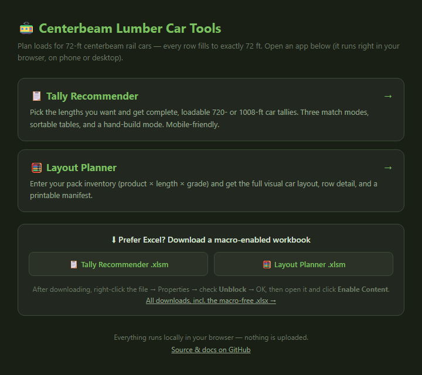
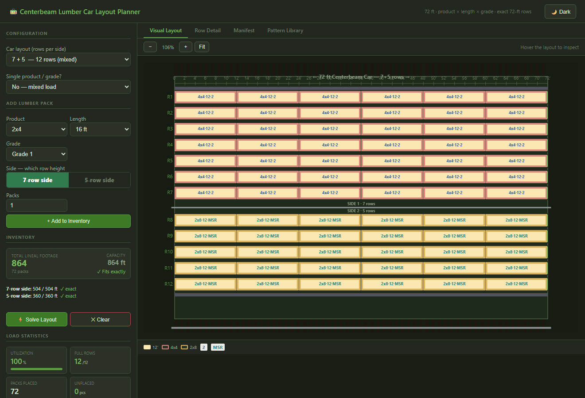
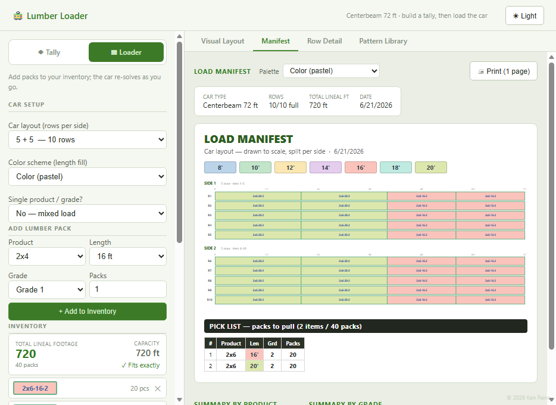
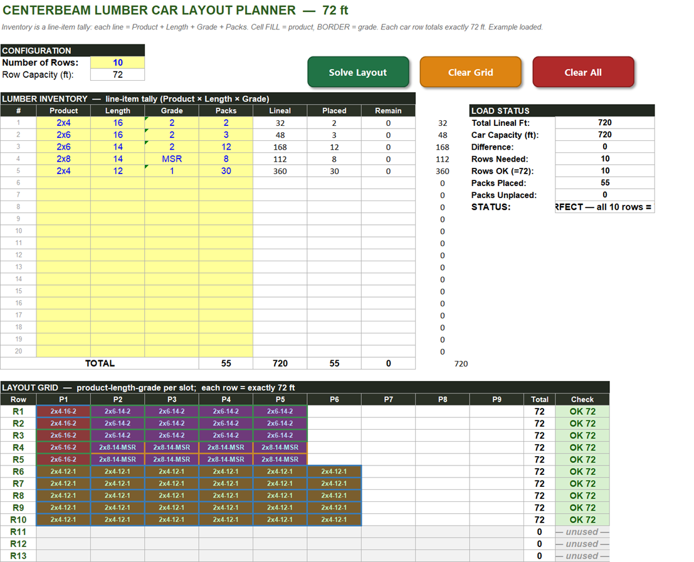
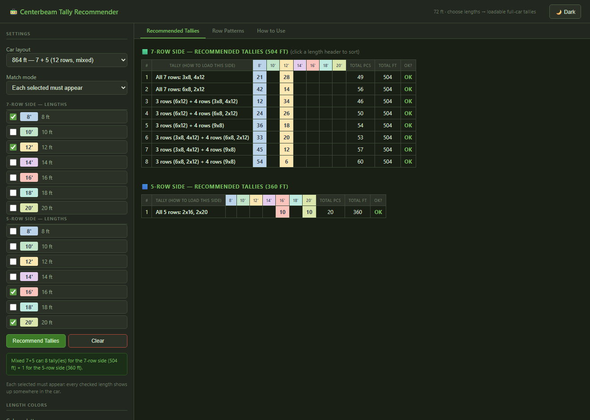
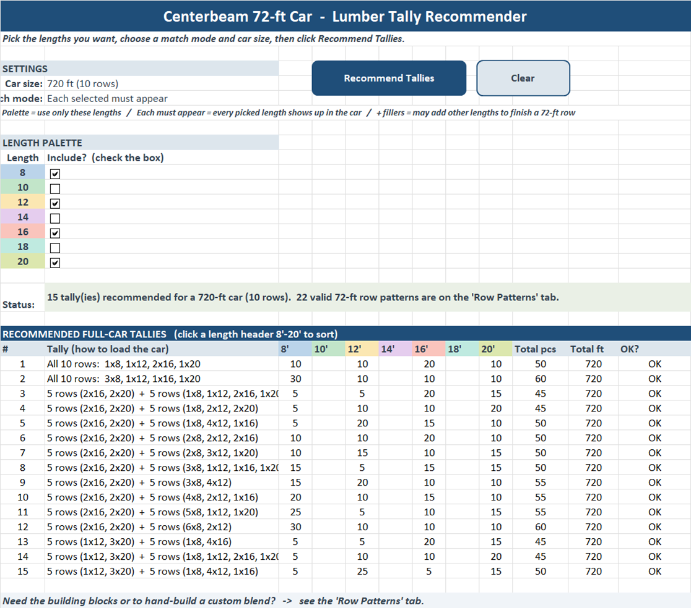

# Centerbeam Lumber Car Tools

[](https://github.com/kenpaine/Lumber-Load-Planning/releases/latest)

## ▶ [Open the App Hub](https://kenpaine.github.io/Lumber-Load-Planning/)

The **[App Hub](https://kenpaine.github.io/Lumber-Load-Planning/)** is the easiest way in — a single
page that launches either **browser app** in one tap (phone or desktop, no install, no macros) and
links straight to the **Excel workbook** downloads.

[](https://kenpaine.github.io/Lumber-Load-Planning/)

**Or jump straight to a tool:**

|  | Open in browser — no install | Download for Excel |
|---|---|---|
| 📋 **Tally Recommender** | [▶ Launch](https://kenpaine.github.io/Lumber-Load-Planning/centerbeam_tally_recommender.html) | [⬇ `.xlsm`](https://github.com/kenpaine/Lumber-Load-Planning/releases/latest/download/Centerbeam_Tally_Recommender.xlsm) |
| 🧮 **Layout Planner** | [▶ Launch](https://kenpaine.github.io/Lumber-Load-Planning/centerbeam_layout_planner.html) | [⬇ `.xlsm`](https://github.com/kenpaine/Lumber-Load-Planning/releases/latest/download/Centerbeam_Lumber_Layout_Planner.xlsm) |

> **After downloading an `.xlsm`:** right‑click the file → **Properties** → check **Unblock** → **OK**, then
> open it and click **Enable Content**. The browser apps need neither step. A macro‑free
> [Layout Planner `.xlsx`](https://github.com/kenpaine/Lumber-Load-Planning/releases/latest) is also on the releases page.

Two tools for loading **72‑ft centerbeam rail cars** with dimensional lumber, where every
car row must fill end‑to‑end to **exactly 72 ft**:

- **Layout Planner** — you have an inventory of packs (product × length × grade) and want
  the full visual load: it fills each row to 72 ft, groups like packs into columns, and
  prints a manifest.
- **Tally Recommender** — you want to build a loadable car from scratch: pick the lengths
  you want and it recommends complete **720‑ or 1008‑ft** tallies that fit, with selectable
  match modes and click‑to‑sort tables.

Each tool ships as a **macro‑enabled Excel workbook** and a **standalone browser app** (no
install, no macros). Only **length** drives the 72‑ft fit.

---

## Centerbeam Layout Planner

### Browser app — `centerbeam_layout_planner.html`

Full‑featured app: line‑item inventory, **single or mixed product/grade**, an
**asymmetric car layout** (5+5, **7+5 mixed**, or 7+7 — with a per‑line side
selector so each side solves independently), the
column‑stacking solver, a proportional visual car layout, Row Detail, and the
Pattern Library. Its **Manifest** matches the Excel tool — a **to‑scale, per‑side
car diagram**, a **dynamic pick list** that wraps into columns when long, and a
**color palette** picker (Color / High contrast / **B & W for printing**) — all on
one landscape page. Light/dark theme throughout.

▶ **[Open it live](https://kenpaine.github.io/Lumber-Load-Planning/centerbeam_layout_planner.html)** — phone or desktop.



**Step by step:**

1. **Set the number of rows** — 10 (720 ft) or 14 (1008 ft).
2. **Choose single or mixed** product/grade. In *single* mode you pick one Product + Grade once
   and only enter **Length + Packs** on each line; *mixed* lets every line differ.
3. **Add your inventory** — pick a Length (and Product/Grade if mixed) and a pack count, then
   **+ Add to Inventory**. Total Lineal Footage and capacity update live.
4. Click **⚡ Solve Layout** — the solver fills each row to exactly 72 ft and stacks like packs
   into columns.
5. Read the result on the tabs: **Visual Layout** (to‑scale, zoomable car), **Row Detail**
   (per‑row breakdown), **Manifest** (the printable one‑page diagram + pick list), and
   **Pattern Library** (every 72‑ft length combination).
6. On the **Manifest** tab, choose a **color palette** — *Color*, *High contrast*, or
   *B & W (print)* — then print (landscape, one page).

The printable **Manifest** — a to‑scale, per‑side car diagram with a pick list and the
color‑palette picker, all sized to one landscape page:



### Excel workbook — `Centerbeam_Lumber_Layout_Planner.xlsm`

Macro‑enabled workbook with one‑click **Solve Layout** / **Clear Grid** / **Clear All**
buttons, live **single product/grade** auto‑fill, and a built‑in **How to Use** tab.
(Shown below in single‑product mode — the greyed Product/Grade columns are auto‑filled.)



---

## Centerbeam Tally Recommender

Pick the lengths you want and the tool recommends **complete, loadable full‑car tallies**
(720 ft = 10 rows, or 1008 ft = 14 rows) built from valid 72‑ft rows.

### Browser app — `centerbeam_tally_recommender.html`

No install, no macros, no security prompts — open it in any browser. The full engine: the
checkbox length palette, all three match modes, all car layouts (incl. a **mixed 7+5** car
that tallies each side independently), click‑to‑sort tables, and a
live hand‑build total. A **color palette** picker (Color / High contrast / **B & W for
printing**) recolors the length swatches, legend, and tables — matching the Layout Planner's
Manifest. Light / dark theme.

▶ **[Open it live](https://kenpaine.github.io/Lumber-Load-Planning/centerbeam_tally_recommender.html)** — phone or desktop.



### Excel workbook — `Centerbeam_Tally_Recommender.xlsm`

Macro‑enabled workbook with a checkbox length palette, colored **Recommend Tallies** /
**Clear** buttons, a sortable recommendations table, a **Row Patterns** tab, and a built‑in
**How to Use** tab. Click *Enable Content* on open.



### How it works

- **Length palette** — check the lengths you want in the car.
- **Match mode** —
  - *Palette — use only selected:* tallies use only the checked lengths.
  - *Each selected must appear* (default): every checked length shows up somewhere in the car.
  - *Each must appear + fillers:* every checked length appears; other lengths may finish a row.
- **Car layout** — 720 ft (5+5, 10 rows), **864 ft (7+5 mixed, 12 rows)**, or 1008 ft (7+7, 14 rows).
  A **mixed 7+5** car loads its two sides to different heights, so the browser app gives each
  side its own length palette and its own recommended tally (7-row side = 504 ft, 5-row = 360 ft).
- **Recommended Full‑Car Tallies** — ready‑to‑load cars: piece count per length, total
  pieces, total feet (always rows × 72), and an OK check. **Click any length header to sort.**
- **Row Patterns** — every way to fill a single 72‑ft row from your lengths (the building
  blocks). Click a length header to sort, or type **Rows to use** to hand‑build a custom car;
  the running total updates live.
- **Color palette** (browser app) — switch the length colors between **Color** (pastel),
  **High contrast** (saturated), and **B & W (print)** (grayscale); the palette checkboxes,
  legend, and every table recolor to match. Use **B & W** for clean black‑and‑white printouts.

---

## What's in this project

| File | What it is |
|------|-----------|
| `Centerbeam_Tally_Recommender.xlsm` | **Tally Recommender (Excel).** Pick lengths → recommended full‑car tallies. Checkbox palette, three match modes, both car sizes, sortable tables, and a **Row Patterns** tab. Click *Enable Content* on open. |
| `centerbeam_tally_recommender.html` | **Tally Recommender (browser).** The same recommender — no install, no macros, no security prompts. Includes a **color palette** picker (Color / High contrast / B & W for printing). |
| `Centerbeam_Lumber_Layout_Planner.xlsm` | **Layout Planner (Excel).** Macro‑enabled workbook with **Solve Layout / Clear Grid / Clear All** buttons, live single product/grade auto‑fill, and a **How to Use** tab. Click *Enable Content* on open. |
| `Centerbeam_Lumber_Layout_Planner.xlsx` | **Layout Planner (macro‑free).** A native replica of the workbook: **formula‑driven single product/grade auto‑fill**, dropdowns, the colored layout grid, and the same **How to Use** tab. Solving is done in the `.xlsm` or the browser app — a `.xlsx` cannot run a solver. |
| `centerbeam_layout_planner.html` | **Layout Planner (browser)** with the full feature set: line‑item inventory (product × length × grade), **single or mixed product/grade**, the column‑stacking solver, a proportional visual car layout, Row Detail, a printable one‑page Manifest with pick list, the length‑colored Pattern Library, and a light/dark theme. Open in any browser, no install. |
| `CenterbeamSolver.bas` | VBA behind the Layout Planner buttons (embedded in its `.xlsm`; kept here as source). |
| `source/build_tally.py`, `source/tally_recommender.bas` | Generator + VBA for the **Tally Recommender** workbook — openpyxl builds the layout, then a pywin32 COM pass injects the macros, buttons, and checkboxes. |
| `source/` (`build_v3*.py`, `solver_v3.py`) | Python that generates the **Layout Planner** workbook. |
| `index.html` | **App Hub** landing page (served by GitHub Pages) — launches the two browser apps and links the Excel downloads. |

> 🚃 **Fastest path:** open the **[App Hub](https://kenpaine.github.io/Lumber-Load-Planning/)** — it launches either browser app in one tap and links both Excel downloads, no repo‑digging required.

---

## Downloading the Excel (`.xlsm`) files

When you download a macro‑enabled `.xlsm` from the internet, Windows tags it with “Mark of
the Web” and Excel **blocks its macros** (a red *SECURITY RISK* banner — *Enable Content*
won’t even appear). To turn them on: **right‑click the file → Properties → check Unblock →
OK**, then open it and click *Enable Content*. The **browser apps have no macros**, so they
never trigger this — they’re the friction‑free way to share.

---

## The model

Every pack of lumber is described by three attributes:

- **Product (cross‑section):** 2x4, 2x6, 2x8, 2x10, 4x4, 4x6, 6x6
- **Length:** 8, 10, 12, 14, 16, 18, 20 ft
- **Grade:** 1, 2, 3, 4, 2P, MSR

A car has **10 or 14 rows**; each row must total **exactly 72 ft** end‑to‑end.
Only **length** affects the 72‑ft fit — cross‑section and grade ride along on each
pack and drive the color scheme and the manifest breakdowns.

---

## Using the Layout Planner workbook

### Planner sheet

1. Set the **Car layout** — `5 + 5` (10 rows), `7 + 5` (12 rows, **mixed**), or
   `7 + 7` (14 rows). The two numbers are the rows on each side of the car; a
   **mixed `7 + 5`** car has a 7‑row side (e.g. short 4×4 stock) and a 5‑row side
   (taller stock). On a mixed car each inventory line gets a colour‑coded **Side**
   cell on the **left** (`7‑row` green / `5‑row` amber — pick from the dropdown or
   **double‑click to flip**); the *same* product can sit on either side, and the two
   sides are solved **independently** to exact 72‑ft rows and kept on their own
   side in the grid and the manifest. *(In the browser app it's a `7 | 5` toggle at
   the left of each line.)*
2. Choose how the car is loaded with the **Single product/grade?** toggle:
   - **Yes (single product/grade)** — most cars. Pick the **Product** and **Grade**
     once in the *Single Product / Grade* box. The Product and Grade columns in the
     inventory are then **greyed out and filled in automatically** — you only enter
     **Length + Packs** on each line.
     - In the **.xlsm**, changing the box updates every line instantly (macros).
     - In the **.xlsx**, the same auto‑fill is driven by formulas keyed off the toggle.
   - **No (mixed)** — the Product and Grade columns become editable again; fill
     Product + Length + Grade + Packs on every line.

   > Live behavior in the `.xlsm` requires macros to be enabled (click *Enable Content* on open).
3. Fill the **line‑item inventory** (dropdowns provided). Lineal ft, Placed, and
   Remaining compute automatically.
4. The **Layout Grid** shows the load, one pack per slot, each row summing to 72 ft.
   - **Fill color = length**
   - **Bold colored border = product**
   - **Text color = grade**
   - Cell text is the full code `product-length-grade` (e.g. `2x6-14-2`).
5. The **Load Status** box reports utilization, full rows, packs placed/unplaced,
   and an overall verdict.

A solved example load is included so the sheet is populated on open.

### Manifest sheet

Auto‑generates from the Planner and is built for a clean **one‑page landscape**
print:

- **Car Layout — drawn to scale**, split per side: each pack is a rectangle whose
  width equals its length in feet, laid out against a 0–72 ft ruler, with rows
  1…N/2 on Side 1 and N/2+1…N on Side 2 — so you can see how the columns line up
  on the car. Redrawn from the solved load whenever you open the tab (or click
  **Redraw**).
- **Pick List** directly beneath it — only the loaded line items (product ×
  length × grade × packs to pull). A long list **wraps into columns to the right**
  instead of growing down, so the diagram always prints as large as possible.
- **Color palette** selector (top‑right, off the printed area): choose **Color**
  (the pastel scheme), **High contrast** (saturated, maximally distinct), or
  **B & W (print)** (grayscale) for clean black‑and‑white printing. The diagram,
  pick list, and length legend all recolor to match.
- **Summary by Product / Grade** and the **Placed Packs — Product × Grade** matrix
  remain below as reference data (off the printed page).

The print area sizes itself to the bottom of the pick list and fits one landscape
Letter page automatically.

### Pattern Library sheet

Reference list of every length combination that sums to 72 ft.

### How to Use sheet

A built‑in reference tab (placed after **Manifest**) that documents every field, the
single vs mixed modes, the buttons, the color key, the other sheets, and
troubleshooting. The `.xlsx` copy is tailored to the macro‑free edition.

---

## One‑click Solve / Clear buttons (macros)

The `.xlsm` has three buttons wired up on the **Planner** sheet — just open it
and click **Enable Content**:

- **Solve Layout** — reads the line‑item inventory, fills every selected row to 72 ft, and
  assigns product+grade grouped so like packs stack in columns. In **single product/grade**
  mode it first fills any blank Product/Grade cells from the defaults you picked.
- **Clear Grid** — clears the layout grid only.
- **Clear All** — empties the grid and the line items.

Behind the buttons is the `CenterbeamSolver` VBA module (`SolveLayout`, `ClearGrid`,
`ClearAll`), kept in source form as `CenterbeamSolver.bas`.

**Using the macro‑free `.xlsx` instead?** It has no buttons, but it still gives you
formula‑driven single product/grade auto‑fill and the full colored layout. To generate a
fresh layout from your own inventory, use the `.xlsm` or the browser app and read or copy
the result. (No‑macro note: in the `.xlsx`, switching a Product/Grade cell from auto‑fill
to a typed‑in value for mixed mode replaces that cell's formula — use the `.xlsm` for
seamless single/mixed switching.)

---

## How the solver works

1. **Length partition.** It enumerates every multiset of lengths that sums to 72 ft
   ("row patterns"), biases toward homogeneous/repeatable patterns, then uses
   backtracking to pick one pattern per row so the per‑length pack counts match
   inventory exactly. This guarantees each chosen row is exactly 72 ft and fills the
   selected number of rows when a solution exists.
2. **Column stacking.** Chosen rows are ordered so identical rows are adjacent and the
   longest packs sit left, so like sizes line up in the same columns.
3. **Product + grade assignment.** For each length, packs are queued grouped by product
   then grade and dealt into that length's slots, so matching product/grade packs stack
   together.

The same algorithm exists in three places (kept in sync):
the workbook's pre‑solved example, the `CenterbeamSolver.bas` macro, and the
JavaScript in `centerbeam_layout_planner.html` (with the generator Python in `source/`).

---

## Regenerating the workbooks (maintainers)

**Tally Recommender** — requires Python 3 with `openpyxl` + `pywin32` and Excel (Windows).
Close the `.xlsm` in Excel first, or the final save hits a file lock:

```bash
python source/build_tally.py
```

openpyxl writes the layout, then a short pywin32 COM pass injects the VBA
(`source/tally_recommender.bas`), the buttons, and the checkboxes, and saves the `.xlsm`.

**Layout Planner** — requires Python 3 with `openpyxl`.

```bash
cd source
python3 build_v3.py        # builds the Planner sheet -> ../cb3.xlsx (writes to /home/claude in original env; adjust paths)
python3 build_v3_p2.py     # adds Manifest, Pattern Library, and the VBA sheet
```

`solver_v3.py` holds the solver and the default example; edit the product list,
grade list, colors, or the default load there. (Paths in the build scripts point at
the original build environment — adjust the input/output paths to your setup.)

---

## Notes & limits

- The 72‑ft fit depends only on **length**. Changing product or grade without changing
  the length mix keeps the layout shape the same and only changes colors/labels — which
  is correct for end‑to‑end loading.
- Perfect top‑to‑bottom column alignment holds **within** a block of identical rows;
  where two blocks meet, the arrangement changes because the packs differ.
- If an inventory's lengths can't be partitioned into exact 72‑ft rows, the solver
  fills as many exact rows as possible and flags the rest as unplaced.
- The macro‑free **`.xlsx` does not run the solver** — it shows a pre‑solved example and
  computes the tallies/status with formulas. Use the `.xlsm` or the browser app to solve
  a new inventory.

---

The apps use a soft **pastel / muted ("Sorbet")** palette — light fills with darker, readable text.

*Color key — Length (fill):* each of 8 · 10 · 12 · 14 · 16 · 18 · 20 ft has its own pastel fill
*Color key — Product (border):* 2x4 blue · 2x6 green · 2x8 gold · 2x10 violet · 4x4 coral · 4x6 teal · 6x6 taupe
*Color key — Grade (text):* 1 green · 2 blue · 3 amber · 4 red · 2P purple · MSR teal

---

## License

Copyright (c) 2026 Ken Paine

This project is licensed under the **GNU General Public License v3.0** — see the
[LICENSE](LICENSE) file for the full text.
