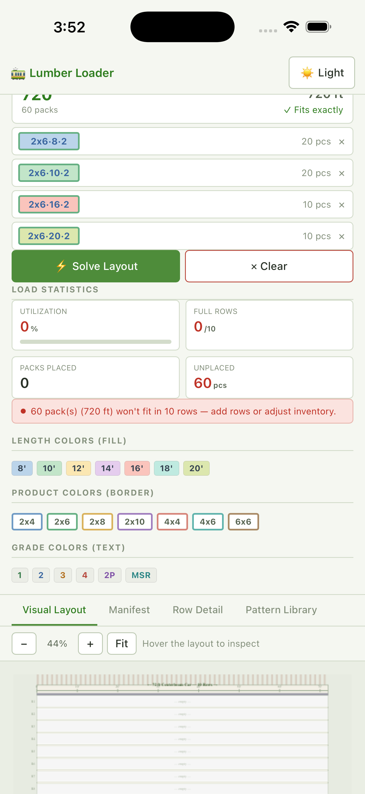

# Lumber Load — iOS app

A native iOS wrapper (via [Capacitor](https://capacitorjs.com/)) for the combined
**Lumber Loader** web app — the Tally Recommender and Layout Planner in a single page,
with an in-app mode switch (◆ Tally / ▦ Loader) and a built-in "design a tally → load
it into the car" handoff.

The repo-root `lumber_loader.html` is the single source of truth;
`scripts/sync-www.mjs` mirrors it into `www/index.html` (the bundle's entry document)
before every build. The app runs fully offline.



**Native haptics:** `lumber_loader.html` calls `@capacitor/haptics` (real Taptic
Engine) via a small `Haptic` helper that no-ops on the plain web. `cap sync` on the
Mac registers the plugin natively — no extra steps. Toggles/taps give a selection
tick, add/remove/clear a light impact, and a perfect Solve / a found Recommendation
give a success notification.

```
app/
  capacitor.config.json   # appId, appName, iOS settings
  package.json            # scripts + Capacitor deps
  scripts/sync-www.mjs    # copies lumber_loader.html into www/index.html
  www/
    index.html            # synced copy of lumber_loader.html (gitignored)
  assets/                 # source icon/splash art for @capacitor/assets
  ios/                    # generated by `cap add ios` (SPM Xcode project; macOS only)
```

---

## Build & run on your iPhone

### What can be done on Windows (already set up here)
- Project config, the web app, dependency install, and `www/` sync.
- `npm install` and `npm run sync-www` work on Windows.

### What requires a Mac (Xcode is macOS-only)
The compile/sign/run step needs Xcode. Capacitor 8 integrates native plugins with
**Swift Package Manager** — there is no CocoaPods, no `Podfile`, and no `pod install`.

On a Mac with **Xcode** installed, from this `app/` folder:

```bash
npm install
npm run cap:add-ios     # syncs www/ then `cap add ios`  (run once)
npm run cap:open        # opens ios/App/App.xcodeproj in Xcode
```
> On first open, Xcode resolves the Swift packages (`capacitor-swift-pm` + the
> haptics plugin) automatically — wait for package resolution to finish before building.

In Xcode:
1. Select the **App** target → **Signing & Capabilities**.
2. **Team** → sign in with your **free Apple ID** (Add Account…). Personal team is fine.
3. Set a unique **Bundle Identifier** if `com.kenpaine.lumberload` is taken.
4. Plug in your iPhone, pick it as the run destination, press **▶ Run**.
5. On the phone: **Settings → General → VPN & Device Management** → trust your developer cert.

> Free Apple ID limits: the app is signed for **7 days** (re-run from Xcode to renew),
> max 3 sideloaded apps. No paid Developer account or TestFlight needed for personal use.

### After editing either web app
Re-mirror the root HTML into the app and push to the native project:

```bash
npm run cap:sync        # sync-www + `cap sync ios`
```
(no need to re-run `cap add ios`).

---

## No Mac handy?
Build the IPA once in the cloud (Codemagic free tier, or a GitHub Actions
`macos-latest` runner), then install/re-sign from Windows with **Sideloadly** or
**AltStore** — same free 7-day signing, done over Wi-Fi.

## App icon & splash
Placeholder icon/splash art ships in `assets/` and is wired through
[`@capacitor/assets`](https://github.com/ionic-team/capacitor-assets). To use your own,
replace the source files (keep the sizes; the **icon must have no alpha/transparency**)
and regenerate:

```bash
# assets/icon-only.png    1024×1024   app icon (no transparency)
# assets/splash.png       2732×2732   launch screen
# assets/splash-dark.png  2732×2732   dark-mode launch screen
npm run assets          # capacitor-assets generate --ios  → writes ios/.../Assets.xcassets
npm run cap:sync
```
